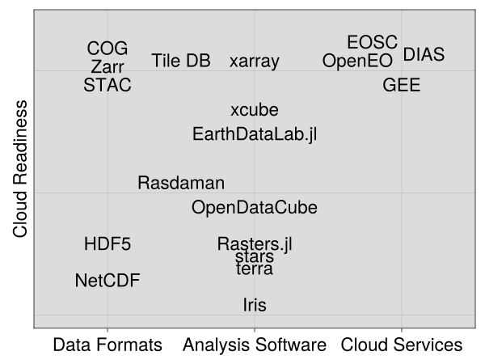

# Overview of data cube technologies and review of other emerging technologies

This document wants to provide the state of the art solutions for local and cloud based data storage and analysis for large gridded data.
In this document we are going to describe software that is currently used by scientists for the analysis of geospatial raster data. 
This is going to be a living document that is updated at least on an annual basis and other emerging technologies are going to be added in the future.
When looking at the diversity of quickly growing number of available tools, data formats and services, an end user might quickly be overwhelmed and confused. 
This document shall not just give a rare description of available tools but should rather help categorizing tools and show how they relate to each other and we will 
try to use a variety of "angles" to look at the tools. 

Geospatial raster data is used in very different user scenarios which can be used as points of view of the comparison of the different raster analysis tools. 
The size of the data and available computing resources play a big role in the choice of the correct tool.
The computing resources can go from a single laptop, to a local cluster where the processing needs to be multi threaded or distributed
 up to cloud computing environments which are composed of multiple clusters.
On their own laptop, scientists are able to control their computing environment but they would have to install software themselves. 
The software for laptops is mainly doing computations single threaded and there is a higher level of interactivity. 
In High Performance Computing (HPC) environments the software runs mainly multi-threaded or multi-core and the software is installed by a local system administrator. 
The computation environment is suited for larger processing and is not as interactive as on a local computer, because computation resources need to be mitigated by a job scheduler. 
In a cloud computing environment like the Google Earth Engine (GEE) or the European Open Science Cloud (EOSC) users are bound to what the cloud provider allows on the platform and this can be quite closed like the GEE where only a special version of Python or Javascript is usable or open as on the EOSC where the user can use containers to run any software on the provided computing resources. 

The tools that are described here can be used for different tasks. 
It can go from extraction of a data for a given spatial and temporal extent to the visualisation of the data, to the processing of the data in batches which also includes machine learning training. These different tasks have all different software needs.

Another angle to look at is the size of the dataset. 
The size of the data set can be described spatially, going from a local dataset like a single satellite acquisition to a regional dataset to a global harmonised dataset. 
The size can also be in terms of the occupied data storage from a few megabytes to multiple petabytes.
A classification of the type of the tool and the cloud readiness, describing, how well one can work on larger scale computations with this tool is shown in Figure 1. 

## Data formats and databases

In this section we discuss data formats and data bases that are often used for the handling of large gridded geospatial data. 

### Cloud Optimized Geotiffs
Cloud optimized geotiffs (COG) are geotiff files which are organized, so that they can be hosted on a HTTP file server. 
This allows more efficient workflows on the cloud. 
COGs in contrast to plain geotiffs can be opened only partially and so it is not needed to download the whole file but you can access only the parts of the file, that are actually needed. 
The cloud optimized geotiff files can be used like normal tiff files and 
therefore this format is supported by many libraries and software solutions. 

### HDF5

HDF5 (Hierarchical Data Format) is a widely used data format for storing n-dimensional array in all kinds of scientific and non-scientific applications. It supports storing multiple
arrays in a single file, named dimensions, several compression codecs and array chunking. HDF5 and variants like NetCDF are widely used in HPC applications because
of their support for mpi-based distributed read and write operations. 

### NetCDF

NetCDF stands for Network Common Data Form and is one of the standard data formats in the geosciences. It is a binary format. The development for NetCDF started in 1988 by UCAR. A NetCDF file is self describing, which means, that it includes a header that describes the data that is included in the netcdf file. 
The most common used NetCDF version is NetCDF-4 which is based on the [HDF 5](#hdf5) format. 
It allows for efficient subsetting but it can not be accessed multi threaded, but supports multi-process read/write operations through mpi.

### TileDB 

TileDB is an open source universal storage engine for dense and sparse multidimensional arrays. In May 2017 TileDB spun out of Intel Labs and the MIT. TileDB allows parallel I/O and supports both local as well as remote storage systems (i.e. object stores, HDFS and Lustre). Data is stored in tiles/chunks. TileDB provides filters like compression and byte shuffling that can be applied on the chunk/tile level. Instead of writing the data in place, TileDB creates a new fragment with each write operations. While this idea of fragments improves latency for write operations this introduces overhead for read operations.

### Zarr

Zarr is a data format for handling of large N-dimensional typed arrays. It focuses on support for distributed storage systems (i.e. object stores). 
It aims to provide efficient I/O for parallel computing.
It can handle different chunks and there are mutliple extensions of the data format for different use cases. It can handle compression. 
It is for data sets that are larger than RAM. The computations on these datasets should be parallizable.

## Open Source Software solutions

### EarthDataLab.jl

Open source Julia library for with an interface for large-scale computations on Earth Data Cubes. Provides access to a variety of file formats like Zarr, NetCDF, GeoTiff and more. 
Enables large distributed computations by appyling arbitrary user-defined functions to huge datasets in an efficient way by respecting the underlying chunking structure of the input datasets. 
Automatically supports multi-threaded and distributed computations or a mix of both, depending on the cluster architecture. 
It tries to mimic the data model of the xarray python library, so that dimension names form the basis of merging broadcast operations

### Rasters.jl

Rasters.jl is a Julia package to work with rasterized spatial data. It can open data from GeoTiff, NetCDF and R grd files. It provides a standardised interface so that many source data types can be used wtih identical syntax. This way, the user does not have to deal with the specifics of spatial file types. 
It can be used for visualisation of the data and for the analysis of the data along one given dimension.

### Rasdaman

Rasdaman is an open source Array / Datacube Database System, which pioneered the whole field. They offer an SQL-like query language called rasql for data definition, retrieval and manipulation. Rasql embeds into standard SQL, sets and implements the ISO 9075 SQL Part 15 for Multi-Dimensional Arrays. It is set up as a client server system.  
Datasets have to be imported to the server with rasql. There are different client implementations from Rasdaman: a command-line utility, a python and web client. All of them offer access to the server through rasql. Other third-party clients for different languages and use cases are available as well.

### OpenEO (Uni Muenster)

### xarray
Xarray is a Python package, that provides an array type with labels and dimension names on top of a NumPy array. Dimensions, coordinates and attributes gives a more intuitive, more concise and less error-prone developer experience.  Xarray allows to apply operations along dimension names, select values of the array based on the label and not only on the integer positions. The mathematical operations are broadcasted across multiple dimensions not based on the array shape, but based on the array labels. 
You can keep track of metadata as a python dictionary. 
You do not need to keep track of the order of the arrays and you do not need to align dimensions with added dimensions of length one.

### xcube

xcube is a Python toolkit which provides Earth Observation data in an analysis-ready form. xcube converts EO data sources into self-contained data cubes which can then be published on the cloud. 
The main data model in the xcube package is an xcube dataset.
A dataset can contain multiple data variables whose values are stored in a common multi dimensional spatio temporal grid. 
These datasets follow the CF conventions. 
A xcube dataset is represented in memory as an xarray Dataset instance. 
xcube uses chunking of the dataset to allow of out-of-core computations.
The chunking of the dataset has a substantial impact on the processing performance of a workflow and xcube provides capabilities to rechunk the xcube dataset.
xcube uses the zarr data format for the on disk representation of the data.

### Iris

Iris is a python package for the analysis and visualisation of Earth science data. Its data model is based on the [[CF Conventions]]. The visualisation is based on [[matplotlib]] and [[cartopy]]. 
The data formats that can be used with Iris are:
[[NetCDF]], [[GRIB]] and [[PP]]. It also has a plugin system available to include other formats.
The Iris package builds upon [[numpy]] and [[dask]].  
It interoperates with the wider python ecosystem by using the standard numpy dask array types as underlying data storage. 

### Open Data Cube

The Open Data Cube (ODC) is a Python based geospatial data management and analysis software.
The ODC can be used to catalogue large amounts of data and to provide them as a Python API for analysis. 
It is mainly used for the analysis of earth observation data in the framework of regional or national data cube platforms.

### stars (Uni Münster?)

### terra

## Cloud solutions

### Google Earth Engine

Google Earth Engine is a cloud platform for the analysis of large geospatial datasets. 
It provides easy access to the Landsat data, the Sentinel data and other different datasets. 
It is currently free, because Google sees it more as a marketing tool. The algorithms that you want to compute on google earth engine have to be written in a strange sub language of java script and you can't bring your own already working script. 
I see a large problem with vendor lock in, because as soon as Google decides that the computation is not free anymore, you can't easily switch to other systems. 
The Google Earth Engine is used for example to provide the global forest cover change map.

### DIAS

The DIAS are the Data and Information Access Services in the european Copernicus programme. 
They provide centralized access to Copernicus data, information and processing tools. 
There are five DIAS platforms online, which allow the users to discover, manipulate, process and download Copernicus data and information. 
All DIAS platforms provide access to the Sentinel and other Copernicus datasets as well as to other additional satellite or non-space datasets. 
The aim of the DIAS platforms is to allow the users to build data processing on the web without having to download the data to a local computer first. 

### EOSC

### OpenEO (Uni Münster ?)

## Miscellaneous Technologies

### Spatio Temporal Asset Catalog (STAC) (Uni Münster ?)

### Interplanetary File System

The interplanetary file system <https://ipfs.io/> is a further development of the torrent system.
It would allow to have one version of a file in a larger network and if a file is requested for  download it can be retrieved from the nearest available position. 
IPFS uses content addressable storage to distribute the file across the network and this makes it more fault tolerant and independent of single infrastructure components. 

### DataLad
